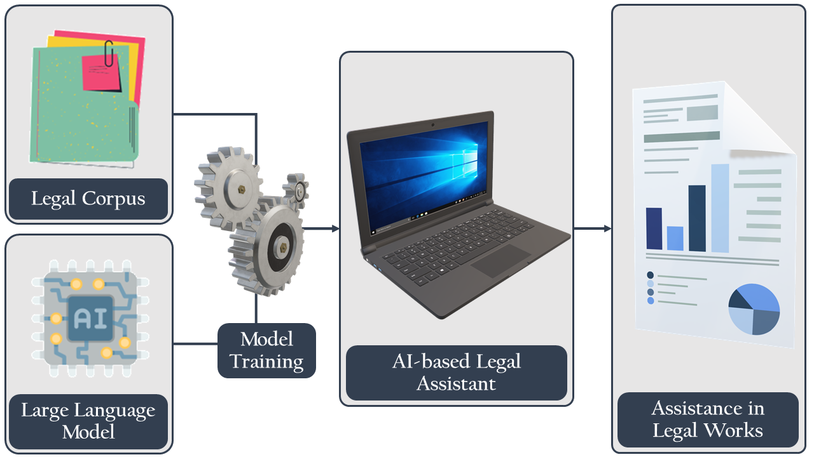

# Exploring Possibilities of AI-Powered Legal Assistance in Bangladesh through Large Language Modeling
- Authors: Wahid Faisal, Mst Rafia Islam, Azmine Toushik Wasi
- Affiliation: Shahjalal University of Science and Technology, Sylhet, Bangladesh; Independent University, Bangladesh
- The `GPT2-UKIL-EN` model is freely available in Hugging Face with DOI: [**10.57967/hf/3233**](https://doi.org/10.57967/hf/3233) with `ciol-research/GPT2-UKILv1`.
- The `UKIL-DB-EN` dataset is freely available in Hugging Face with DOI: [**10.57967/hf/3235**](https://doi.org/10.57967/hf/3235) with `ciol-research/UKIL-DB-EN`.

---

**Abstract:** Bangladesh's legal system struggles with major challenges like delays, complexity, high costs, and millions of unresolved cases, which deter many from pursuing legal action due to lack of knowledge or financial constraints. This research seeks to develop a specialized Large Language Model (LLM) to assist in the Bangladeshi legal system.
We created `UKIL-DB-EN`, an English corpus of Bangladeshi legal documents, by collecting and scraping data on various legal acts. We fine-tuned the `GPT-2` model on this dataset to develop GPT2-UKIL-EN`, an LLM focused on providing legal assistance in English.
The model was rigorously evaluated using semantic assessments, including case studies supported by expert opinions. The evaluation provided promising results, demonstrating the potential for the model to assist in legal matters within Bangladesh.
Our work represents the first structured effort toward building an AI-based legal assistant for Bangladesh. While the results are encouraging, further refinements are necessary to improve the model's accuracy, credibility, and safety. This is a significant step toward creating a legal AI capable of serving the needs of a population of 180 million.

---





#### **Cite as**:
```
@misc{rafia2024ukil,
      title={Exploring Possibilities of AI-Powered Legal Assistance in Bangladesh through Large Language Modeling}, 
      author={Wahid Faisal and Mst Rafia Islam and Azmine Toushik Wasi},
      year={2024},
      url={https://github.com/ciol-researchlab/UKIL}, 
}
```